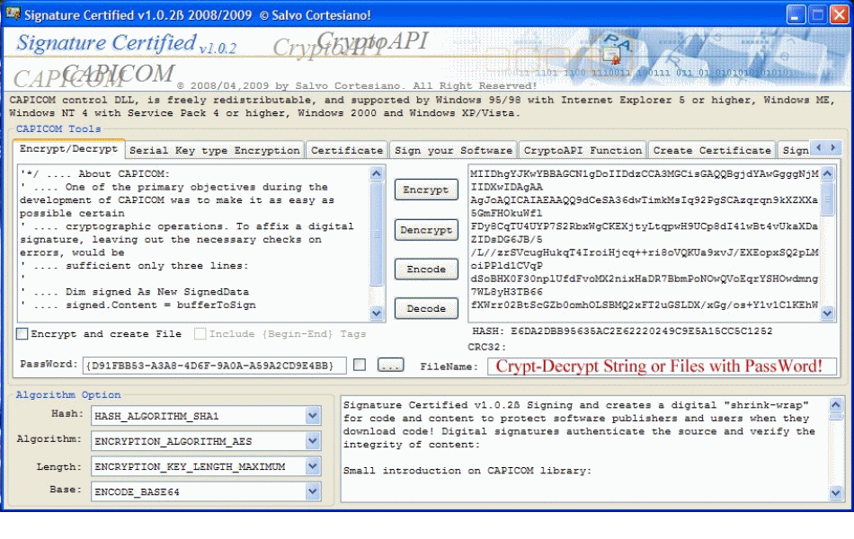



## CAPICOM Sign and create Certificate

### Description

Signature Certified v1.0.2&#223; Signing and creates a digital "shrink-wrap" for code and content

to protect software publishers and users when they download code!

Digital signatures authenticate the source and verify the integrity of content:

Small introduction on CAPICOM library:

Schematized the functionality of CAPICOM:

Digital signature with ASN.1 encoding and support to the standard PKCS # 7

Support for smart-card recognized by Windows

Symmetric key encryption

Asymmetric Key Encryption (envelop)

Calculating Hash -- This function i like it very much :)

CodeSigning for Authenticode

Utilities to support conversions of strings and generations of pseudo-random numbers

Interfaces support the CryptoAPI and CAPICOM objects and vice versa

Support X509 certificates

Support to store certificates.

Searches within the store

Support for Certificate Policies, Application Policies and templates

Support to export sensitive information via PFX and PKCS # 12

Support for AES encryption (only on XP and above)

Happy Coding ;)

Salvo Cortesiano (IT)

Links:

http://www.microsoft.com/downloads/details.aspx?familyid=860EE43A-A843-462F-ABB5-FF88EA5896F6&amp;displaylang=en

http://www.wiscocomputing.com/articles/code-signing.htm

----

For a complete project (contains missing files), to download this at: http://www.netshadows.it/capicom.rar (4,51 MB)
 
### More Info
 

             |
---                |---
**Submitted On**   |2009-04-06 15:53:22
**By**             |[Salvo Cortesiano \(Italy\)](https://github.com/Planet-Source-Code/PSCIndex/blob/master/ByAuthor/salvo-cortesiano-italy.md)
**Level**          |Intermediate
**User Rating**    |4.3 (26 globes from 6 users)
**Compatibility**  |VB 6\.0
**Category**       |[Complete Applications](https://github.com/Planet-Source-Code/PSCIndex/blob/master/ByCategory/complete-applications__1-27.md)
**World**          |[Visual Basic](https://github.com/Planet-Source-Code/PSCIndex/blob/master/ByWorld/visual-basic.md)
**Archive File**   |[CAPICOM\_Si2149394102009\.zip](https://github.com/Planet-Source-Code/salvo-cortesiano-italy-capicom-sign-and-create-certificate__1-71971/archive/master.zip)

